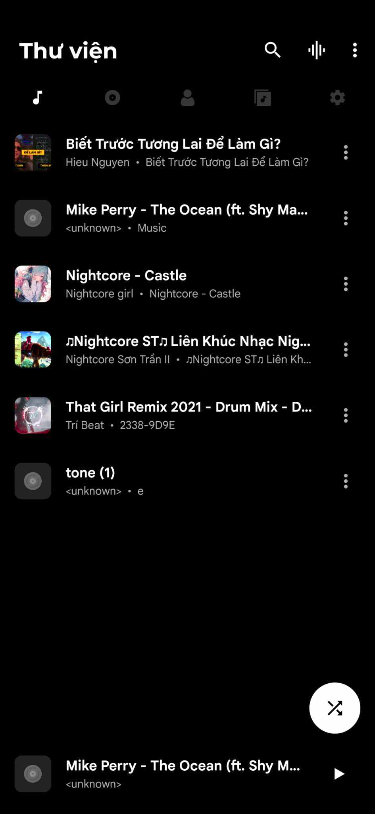
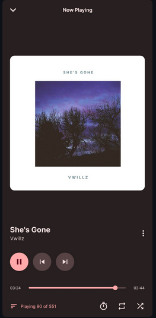

# Moon

## Phía front-end

Giao diện tab, là một app nghe nhạc offline bth
có chức năng upload và sync nhạc lên server

- Danh sách nhạc
- View khi phát nhạc
- tua, next các kiểu

### Giao diện tab
- Gồm các tab: bài hát, album, nghệ sĩ danh sách phát

Bài hát: Liệt kê các bài hát

Album: Liệt kệ các album, khi click vào album đó sẽ hiện ra một danh sách bài hát (thuộc album đó).
Nghệ sĩ: Như album
Danh sách phát: Như album.

> Quan trọng là code được 1 danh sách các bài hát, như này:
> 

### Giao diện player
- Các icon lấy ở đâu?

### Chơi nhạc
- Chơi nhạc trên android kiểu gì?
- Làm sao để load được file nhạc?
- Làm sao để có thể next, load, tạm dừng?

### Phía backend

Gồm hai thực thể chính là 
- User
- Song
- Playlist

Yêu thích cũng chỉ là playlist đặc biệt

quan hệ 1 User -> n playlist
1 playlist -> n song

-> 1 user : n song
1 song sẽ có 1 field playlists: Favorite;Playlist1;Playlist2;
-> dễ hơn cho việc đồng bộ.

Phía server cần có CRUD các thực thể này

- Quản lý user (có sẵn trong Spring, game dễ)
- Quản lý playlist (CRUD)
- Quản lý bài hát (Chỉ sync thôi, muốn nghe thì phải sync từ mobile trước)

### req
- Đăng ký
- Đăng nhập
- Đăng xuất
- Bảo vệ api

Spring security
session based
JWT -> stateless.

## Hành vi

Sau khi cài đặt -> bắt người dùng đăng ký tài khoản
Quét các file nhạc trên máy

Chức năng đồng bộ:
đồng bộ danh sách playlist và nhạc lên server.

Bài toán khó:
Làm sao để biết sự khác nhau giữ local và server?
-> Gọi API xem dữ liệu các bài hát -> update cho phù hợp.

